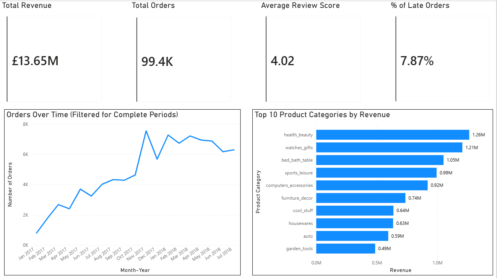
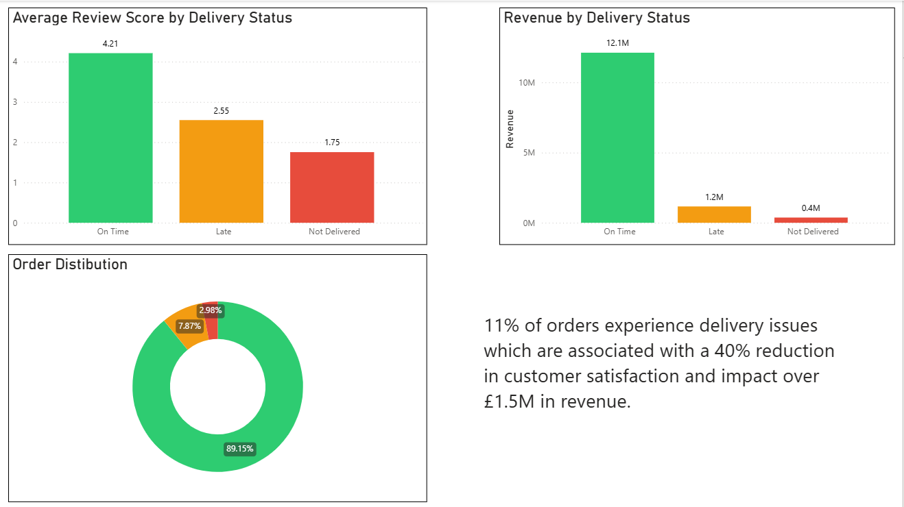

# E-commerce Delivery Performance Analysis (SQL + Power BI)

## Overview

I analysed a public e-commerce dataset to assess whether delivery performance affects customer satisfaction and revenue. The dataset included purchase timestamps, promised and actual delivery dates, item-level revenue, and customer review scores, making delivery reliability a measurable operational lever.

The analysis found that delivery issues affect around 11% of orders and are associated with materially lower customer satisfaction. Orders delivered on time average a review score of about 4.21, versus 2.55 for late deliveries and 1.75 for undelivered orders. Revenue tied to late or failed deliveries exceeds £1.5M.

## Business Question

This project aimed to answer three questions:

1. How are orders and revenue trending over time?
2. Which product categories contribute most of the revenue?
3. How strongly is delivery performance associated with customer satisfaction and revenue impact?

I chose this objective after exploring the dataset and seeing that it contained both delivery timestamps and customer review scores.

## Dataset

I used the Olist Brazilian e-commerce dataset, covering roughly 100,000 orders from 2016 to 2018.

Tables used:
- orders
- order_items
- customers
- products
- product_category_name_translation
- reviews

## Tools

- SQL (DuckDB)
- Power BI

## Approach

- Built a base dataset using SQL by joining orders, order items, products, and reviews
- Created a delivery status classification: On Time, Late, Not Delivered
- Aggregated key metrics such as revenue, order volume, and average review score
- Analysed the relationship between delivery performance, customer satisfaction, and revenue
- Built a 2-page Power BI dashboard to present findings

## Key Results

- Around 11% of orders experienced delivery issues
- On-time deliveries averaged a review score of ~4.21
- Late deliveries averaged ~2.55
- Not delivered orders averaged ~1.75
- Late deliveries corresponded to roughly a 40% reduction in customer satisfaction relative to on-time orders
- More than £1.5M in revenue was linked to delayed or failed deliveries
- Revenue was concentrated in a small number of product categories, including segments such as health_beauty and watches_gifts

## Recommendations

- Improve delivery reliability for underperforming sellers or logistics partners through monitoring and service-level targets
- Recalibrate estimated delivery dates using historical delivery performance so customer promises are more realistic
- Track delivery status as a core performance metric alongside revenue and review score
- Identify and prioritise underperforming sellers or logistics partners contributing to late deliveries, and implement performance monitoring or service-level agreements

## Dashboard

### Executive Summary
- Total revenue
- Total orders
- Average review score
- % late orders
- Monthly order trend
- Top 10 product categories by revenue

### Delivery & Satisfaction
- Average review score by delivery status
- Revenue by delivery status
- Order distribution by delivery status
- Headline business insight

## Screenshots

### Page 1 – Executive Summary

### Page 2 – Delivery & Satisfaction

## SQL Files

SQL used in this project can be found in the `sql/` folder.